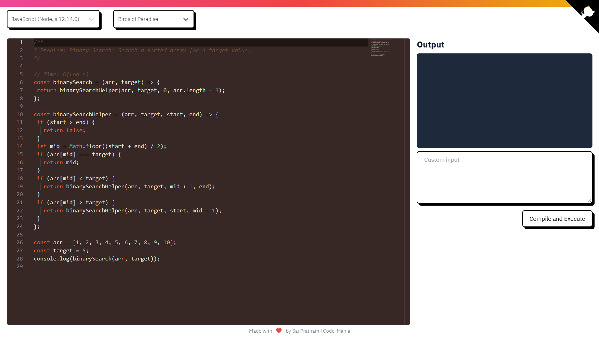

# Code-Mania - Online Code Editor and Compiler



Code-Mania is a powerful online code editor and compiler that supports 40+ programming languages. Built with React and powered by the Judge0 API, it provides a seamless coding experience with features like syntax highlighting, multiple themes, and real-time compilation.

## ✨ Features

- 🎨 **Multiple Themes** - Choose from a variety of editor themes including dark mode
- 🌈 **40+ Languages** - Support for all major programming languages
- ⚡ **Real-time Compilation** - Compile and run code instantly
- 📝 **Custom Input** - Test your code with custom inputs
- 🎯 **Error Handling** - Clear error messages and compilation status
- 💻 **Monaco Editor** - Professional code editing experience
- 🌙 **Dark Mode** - Easy on the eyes with full dark theme support

## 🚀 Getting Started

### Prerequisites

- Node.js (version 14 or higher)
- npm or yarn
- A RapidAPI account for Judge0 API access

### Installation

1. Clone the repository:
```bash
git clone https://github.com/Sai-Pratham05/code-mania.git
cd code-mania
```

2. Install dependencies:
```bash
npm install
```

3. Create a `.env` file in the root directory and add your RapidAPI credentials:
```env
REACT_APP_RAPID_API_URL=your_api_url
REACT_APP_RAPID_API_HOST=your_api_host
REACT_APP_RAPID_API_KEY=your_api_key
```

4. Start the development server:
```bash
npm start
```

The application will be available at `http://localhost:3000`

## 🛠️ Built With

- [React](https://reactjs.org/) - Frontend framework
- [Monaco Editor](https://microsoft.github.io/monaco-editor/) - Code editor
- [Judge0 API](https://judge0.com/) - Code compilation and execution
- [Tailwind CSS](https://tailwindcss.com/) - Styling
- [React Toastify](https://fkhadra.github.io/react-toastify/) - Notifications

## 📝 Usage

1. Select your programming language from the dropdown
2. Choose your preferred theme
3. Write or paste your code in the editor
4. Add any custom input if required
5. Click "Compile and Execute" to run your code
6. View the output or error messages in the output window


## 🤝 Contributing

Contributions are welcome! Feel free to:

1. Fork the repository
2. Create your feature branch (`git checkout -b feature/AmazingFeature`)
3. Commit your changes (`git commit -m 'Add some AmazingFeature'`)
4. Push to the branch (`git push origin feature/AmazingFeature`)
5. Open a Pull Request

## 📄 License

This project is licensed under the MIT License - see the [LICENSE](LICENSE) file for details.

## 🙏 Acknowledgments

- [Judge0](https://judge0.com/) for their amazing API
- [Monaco Editor](https://microsoft.github.io/monaco-editor/) team
- All contributors and supporters

---

<div align="center">
Made with ❤️ by Sai Pratham | Code-Mania
</div>
